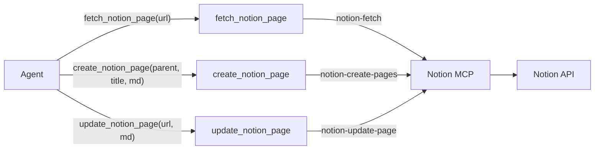

# Notion Pages Integration

**Status: Archived** — Implemented in commit `9930c4d`.

Depends on: existing multi-service MCP infrastructure (`connection.ts`)

## Architecture

Same pattern as Jira and Slack. The agent sees `fetch_notion_page`, `create_notion_page`, and `update_notion_page` — never the raw MCP.



## MCP Connection

Notion's hosted MCP at `https://mcp.notion.com/mcp` uses standard OAuth with dynamic client registration — same flow as Jira. No static client credentials needed (unlike Slack). Added to `connection.ts` `SERVICES` map as:

```ts
notion: { serverUrl: "https://mcp.notion.com/mcp", name: "notion" }
```

## URL Parsing

Notion page IDs are 32 hex characters, typically the last segment of a URL. A shared `parseNotionId` utility handles:

- Full URLs: `https://www.notion.so/workspace/Page-Title-a1b2c3d4e5f67890abcdef1234567890` → `a1b2c3d4e5f67890abcdef1234567890`
- Notion Sites: `https://myspace.notion.site/Page-Title-abc123def456` → extracted hex ID
- Raw UUIDs: `a1b2c3d4-e5f6-7890-abcd-ef1234567890` → passed through with dashes stripped
- Query params: `?v=...` and `#...` are stripped before extraction

The `notion-fetch` MCP tool also accepts full URLs directly, so `fetch_notion_page` can pass URLs through without parsing. Parsing is needed for `create_notion_page` (parent `page_id`) and `update_notion_page` (`page_id`).

## Harness tools to create

### `src/tools/notion/client.ts`

Lazy MCP connection to Notion. Calls `connect("notion")`. Same pattern as `jira/client.ts` and `slack/client.ts`. Includes `callNotionTool` wrapper that checks `result.isError` and throws, and `extractTextContent` to pull text from MCP response blocks.

### `src/tools/notion/fetch-page.ts`

- **Type:** External
- Wraps `notion-fetch` MCP call
- Input: `{ pageUrl: string }` — Notion URL or page ID
- Returns: `{ title, content, pageId, url }` + summary string
- The `notion-fetch` tool returns markdown content directly — this tool extracts the title and content from the response

### `src/tools/notion/create-page.ts`

- **Type:** External
- Wraps `notion-create-pages` MCP call
- Input: `{ parentPageUrl: string, title: string, content?: string, contentFrom?: string }`
- `parentPageUrl` is parsed to extract the page ID for the MCP `parent.page_id` field
- If `contentFrom` is set, resolves the full content from the tool call log via `resolveContentRef`
- Returns: `{ pageId, url }` + summary string

### `src/tools/notion/update-page.ts`

- **Type:** External
- Wraps `notion-update-page` MCP call with `command: "replace_content"`
- Input: `{ pageUrl: string, content?: string, contentFrom?: string, title?: string }`
- `pageUrl` is parsed to extract the page ID
- If `contentFrom` is set, resolves the full content from the tool call log
- If `title` is provided, issues a separate `update_properties` call to update the title
- Returns: `{ pageId }` + summary string

### `src/tools/notion/index.ts`

Barrel export for all three tools.

## Files to modify

### `src/lib/connection.ts`

Add `notion` entry to `SERVICES`.

### `src/agent/registry.ts`

Import and register `fetchNotionPageTool`, `createNotionPageTool`, and `updateNotionPageTool`.

### `src/prompts/orchestrator.md`

Update identity line to include Notion: "You are a project management assistant with access to Jira, Slack, Notion, and a local team roster."

## Authentication

Notion uses standard OAuth with dynamic client registration — same as Jira. No app creation or client credentials needed (unlike Slack). The existing `auth.ts`, `check.ts`, and `list-tools.ts` scripts already accept any service key from the `SERVICES` map, so adding `notion` to `connection.ts` makes these commands work automatically:

```bash
npm run auth -- notion     # OAuth flow (opens browser)
npm run check -- notion    # verify connection
npm run tools -- notion    # list available MCP tools
```

Tokens are cached in `~/.mcp-auth/` by `mcp-remote`.

## Documentation

### `docs/notion-setup.md`

Setup guide covering:
- Prerequisites (Notion account with workspace access)
- Running `npm run auth -- notion`
- Verifying with `npm run check -- notion`
- Troubleshooting common auth issues

### `README.md`

- Update intro line to mention Notion
- Add Notion usage example
- Add Notion tools to the tools table
- Add `tools/notion/` to project structure
- Link to `docs/notion-setup.md`

## Tests

### `src/tools/notion/notion.test.ts`

- `parseNotionId` — test URL parsing for all URL variants, raw UUIDs, and invalid inputs
- `fetch-page` — test markdown extraction from MCP response
- `create-page` — test parameter construction (parent page ID extraction, contentFrom resolution)
- `update-page` — test parameter construction and content resolution

No LLM calls, no network calls. Mock the MCP client responses.
