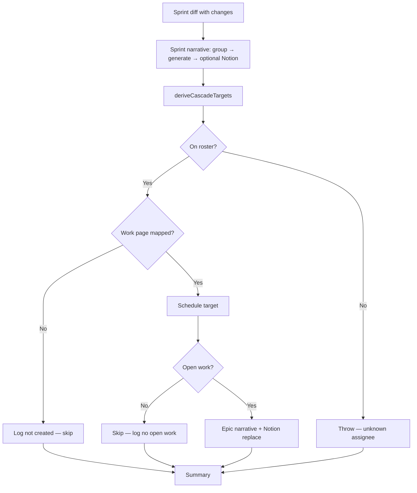

# Epic Notion Cascade — Design

Depends on: sprint snapshot diff (`jira_search_snapshots`), epic narrative tools (`generate_epic_narrative`), Notion update (`update_notion_page`), roster (`read_roster` / `write_roster`).

## Architecture

Current sprint flow:

```
resolve → sprint JQL → search → diff → [stop if unchanged]
  → save → group → generate_sprint_narrative → [optional Notion]
```

New flow (when sprint diff shows changes):

```
resolve → sprint JQL → search(resolveParentsTo: Epic) → diff
  → save
  → group → generate_sprint_narrative → [optional sprint Notion]
  → cascade_epic_notion_updates          ← NEW (after sprint narrative)
```

Per work page inside cascade:

```
derive targets from sprint diff + baseline
  → resolve work pages (skip unmapped — log "not created")
  → fail only if assignee not on roster
  → for each (assignee, pageUrl):
      build_epic_jql(epicKeys, assignee)   // no statusCategories
      → search_jira_issues
      → jira_search_snapshots save         // no diff early-exit
      → group_issues(status)
      → generate_epic_narrative
      → update_notion_page(contentFrom)
```



Sprint diff is the **only** change trigger. Epic JQL diff is saved for future baselines but never used to skip cascade execution.

## Roster schema extension

```typescript
interface RosterWorkPage {
  page: string;       // Notion URL for this work page
  epics: string[];    // one or more Jira epic keys covered by this page
}

interface RosterEntry {
  name: string;
  shortName: string;
  accountId: string;
  displayName: string;
  roles?: string[];
  notion?: { homepageUrl: string };
  slack?: { channelId: string };
  workPages?: RosterWorkPage[];
}
```

Example (`roster.example.json`):

```json
{
  "name": "Jane Smith",
  "shortName": "Jane",
  "accountId": "712020:00000000-0000-0000-0000-000000000001",
  "displayName": "Jane Smith",
  "notion": { "homepageUrl": "https://www.notion.so/workspace/Jane-Hub-abc123" },
  "slack": { "channelId": "C01234567" },
  "workPages": [
    {
      "page": "https://www.notion.so/workspace/Platform-Epic-def456",
      "epics": ["PROJ-100"]
    }
  ]
}
```

### Work page lookup

`findWorkPage(rosterEntry, epicKey)` → the `RosterWorkPage` whose `epics` array contains `epicKey`, or null.

When grouping targets for execution, dedupe by `(assigneeAccountId, pageUrl)`. For each group, pass **all** `epics` from that work page entry to `build_epic_jql` (full page view even if only one epic triggered).

## Assignee change detection

### Changes to `src/tools/jira/search-issues.ts`

Add to `JiraIssue`:

```typescript
assigneeAccountId: string | null;
```

Parse from `fields.assignee.accountId` (Atlassian account ID string).

### Changes to `src/tools/jira/snapshots.ts`

Add to diff:

```typescript
assigneeChanges: Array<{ key: string; was: string | null; now: string | null }>;
```

In `diffIssues`, when baseline and fresh both have the issue, compare `assigneeAccountId` (same pattern as `parentChanges`).

Export `AssigneeChange` type alongside `ParentChange`.

### Changes to `src/tools/jira/format-diff.ts`

Extend `DiffData` with `assigneeChanges`. Render in `formatDiffBlock` (e.g. `PROJ-501: Alice → Bob` using roster short names when available, else account IDs).

## Cascade target derivation

### New file: `src/lib/epic-cascade.ts`

Pure functions, no I/O:

```typescript
interface CascadePair {
  assigneeAccountId: string;
  epicKey: string;
}

interface CascadeWorkPageTarget {
  assigneeAccountId: string;
  assigneeDisplayName: string;
  pageUrl: string;
  epicKeys: string[];   // all epics on the work page entry
}

interface DeriveResult {
  pairs: CascadePair[];
  unassignedKeys: string[];
}

interface NotCreatedTarget {
  assigneeAccountId: string;
  assigneeDisplayName: string;
  epicKey: string;
  reason: "not created";
}

function deriveCascadePairs(diff: DiffData, freshIssues: JiraIssue[], baselineIssues: CachedIssue[]): DeriveResult;
function resolveWorkPageTargets(pairs: CascadePair[], roster: RosterEntry[]): {
  targets: CascadeWorkPageTarget[];
  notCreated: NotCreatedTarget[];
};
function validateRosterMembership(pairs: CascadePair[], roster: RosterEntry[]): string[];  // empty = ok; throws if assignee missing
function countOpenWork(issues: JiraIssue[]): number;
```

**Pair derivation rules** (epic key from `parent.key` via sprint search with `resolveParentsTo: "Epic"`):

| Diff signal | Pairs added |
|-------------|-------------|
| `added` | `(fresh.assigneeAccountId, fresh.parent.key)` — skip if unassigned |
| `statusChanges` | `(fresh.assigneeAccountId, fresh.parent.key)` |
| `removed` | `(baseline.assigneeAccountId, baseline.parent.key)` from baseline map |
| `parentChanges` | `(assignee, wasEpic)` and `(assignee, nowEpic)` — assignee from fresh issue |
| `assigneeChanges` | `(was, epic)` and `(now, epic)` — epic from fresh issue's parent |

Use a `Set` keyed by `"accountId|epicKey"` to dedupe pairs.

**Unassigned**: if `assigneeAccountId` is null for a changed ticket, add key to `unassignedKeys` instead of pairs.

**Grouping**: for each pair on the roster, resolve work page via `findWorkPage`. Pairs with no matching `workPages` entry are appended to `notCreated` with reason `"not created"` and excluded from execution. Remaining pairs are deduped into unique `(assigneeAccountId, pageUrl)` targets with union of all `epics` from the matched work page entry.

**Roster check**: if a derived pair's assignee is not on the roster, throw before any LLM call (collect all unknown assignees in one error message).

## New tool: `cascade_epic_notion_updates`

### File: `src/tools/jira/cascade-epic-notion.ts`

Reads from `context.toolCallLog`:

1. Latest `jira_search_snapshots` diff (must exist and `changed === true`, or first run with no baseline — same condition as sprint skill continuing past diff)
2. Latest `search_jira_issues` fresh issues
3. Baseline issues from snapshot cache for the sprint JQL thread (reuse snapshot read logic from diff action)
4. Roster via `readRoster` file load (direct read, not tool call)

Execute:

1. `deriveCascadePairs` → `validateRosterMembership` (throw if unknown assignee) → `resolveWorkPageTargets`
2. For each `CascadeWorkPageTarget`:
   - Execute epic JQL build + search (internal or via shared helpers extracted from existing tools)
   - If zero non-epic child issues → append to `skipped` with reason `"no open work"`; continue
   - Append synthetic entries to a local mini `toolCallLog` OR call extracted `generateEpicNarrativeForContext(...)` with the required prior results
   - Call Notion update with narrative markdown
   - Append to `updated`
3. Return `{ updated, skipped, notCreated, unassignedKeys, summary }`

**Implementation note:** Prefer extracting shared execute helpers from `build_epic_jql`, `group_issues`, and `generate_epic_narrative` rather than duplicating logic. The cascade tool orchestrates; it does not reimplement LLM prompts. Options:

- **A (preferred):** Export `executeGroupIssues`, `executeGenerateEpicNarrative` internals that accept explicit inputs instead of only reading the log.
- **B:** Push synthetic `toolCallLog` entries before each generate call.

Option A keeps tests cleaner.

### Tool registration

Add to `src/tools/jira/index.ts` and agent registry.

Description should state: call once after sprint diff + save and after generate_sprint_narrative (and optional sprint Notion update). Requires sprint search with `resolveParentsTo: "Epic"`.

## Roster tool changes

### `src/tools/roster/read.ts`

Extend `RosterEntry` interface with optional `notion`, `slack`, `workPages`. Update tool description.

### `src/tools/roster/write.ts`

New actions:

| Action | Args | Behavior |
|--------|------|----------|
| `set_notion` | `accountId`, `homepageUrl` | Set or replace `notion.homepageUrl` |
| `set_slack` | `accountId`, `channelId` | Set or replace `slack.channelId` |
| `add_work_page` | `accountId`, `page`, `epics[]` | Append work page entry |
| `remove_work_page` | `accountId`, `page` | Remove entry matching page URL |

Existing `add` action MAY accept optional `notion`, `slack`, `workPages` for convenience.

### `src/config/roster.example.json`

Add commented example with placeholder Notion URLs and one work page.

### `src/skills/roster.md`

Document new write_roster actions for publishing config.

## Sprint skill changes

### `src/skills/sprint-narrative.md`

Insert new step after sprint narrative (and optional sprint Notion update):

```
5. group_issues (unchanged)
6. generate_sprint_narrative (unchanged)
7. (Optional) update_notion_page for sprint report (unchanged)
8. cascade_epic_notion_updates — call once when diff showed changes.
   Runs after sprint narrative. Skips epic×assignee pairs with no workPages mapping (logs "not created"). Fails only if a derived assignee is not on the roster.
   Skips work pages with no open issues; logs unassigned changed tickets.
```

Clarify: unchanged sprint diff → STOP before step 5 (no cascade).

## Epic skill

No change to `src/skills/epic-narrative.md` for MVP. Standalone epic runs keep their own diff gate.

## Notion integration

Reuse existing `update_notion_page` with explicit `content` string from cascade's local generate result, or `contentFrom` if the mini log pattern is used. Full `replace_content` only.

## Tests

Mark matching spec scenarios `[tested]` in `openspec/specs/epic-notion-cascade/spec.md` only after automated tests land.

### `src/tools/jira/snapshots.test.ts` (extend or new)

- Assignee change detected between baseline and fresh
- Unassigned → assigned and assigned → unassigned transitions
- No false positive when assignee unchanged

### `src/lib/epic-cascade.test.ts` (new)

- deriveCascadePairs: added, removed, status, parent, assignee changes
- Unassigned keys logged, not paired
- resolveWorkPageTargets: unmapped epic → notCreated with reason "not created"
- validateRosterMembership: unknown assignee → throws before any LLM call

### `src/tools/jira/cascade-epic-notion.test.ts` (new)

- Missing work page mapping → notCreated, no LLM mock calls for that pair
- Unknown assignee → throws before any LLM calls
- Empty work skip — no LLM, no Notion
- Happy path: one target → generate + Notion replace (mock LLM + Notion MCP)
- Unassigned keys appear in result
- Full epic view: build_epic_jql called without statusCategories even when sprint JQL had filter

Mock pattern: follow `generate-sprint-narrative.test.ts` — fixture issues, mock `context.llm.generate`, mock Notion client.

### `src/tools/roster/roster.test.ts` (extend)

- read returns new fields
- write_roster set_notion, add_work_page, remove_work_page
- roster.example.json includes notion, slack, workPages placeholders

### `src/skills/sprint-narrative.test.ts` (new or extend)

- Skill lists cascade_epic_notion_updates after generate_sprint_narrative (and after optional sprint Notion step)
- Skill does not call cascade when diff step stops the run
- Regenerate prose path does not add standalone epic refresh instructions

### `src/tools/jira/format-diff.test.ts` (extend if exists)

- assigneeChanges rendered in diff block

## Files to modify

| File | Change |
|------|--------|
| `src/lib/epic-cascade.ts` | **New** — derive, group, validate |
| `src/tools/jira/cascade-epic-notion.ts` | **New** — cascade orchestration tool |
| `src/tools/jira/search-issues.ts` | Add `assigneeAccountId` |
| `src/tools/jira/snapshots.ts` | `assigneeChanges` in diff |
| `src/tools/jira/format-diff.ts` | Extend DiffData + formatDiffBlock |
| `src/tools/roster/read.ts` | Extended RosterEntry |
| `src/tools/roster/write.ts` | New write actions |
| `src/config/roster.example.json` | Example publishing fields |
| `src/skills/sprint-narrative.md` | Cascade step after sprint narrative |
| `src/skills/roster.md` | Document publishing actions |
| `src/tools/jira/index.ts` | Export cascade tool |
| `src/tools/jira/generate-epic-narrative.ts` | Optional: export helper for cascade reuse |
| `src/tools/jira/group-issues.ts` | Optional: export helper for cascade reuse |

## Documentation

- Update `docs/notion-setup.md` with a short section on roster `workPages` and cascade behavior (no new doc file unless requested).

## Out of scope (explicit)

- Epic narrative cache / selective status-section regen
- Standalone epic refresh without sprint diff
- Slack post on cascade (`slack.channelId` stored but unused)
- Auto-create Notion pages or write URLs back to roster
