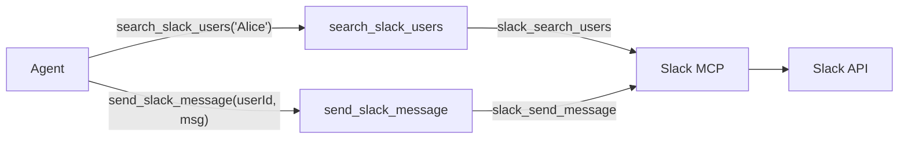

# Slack Integration: Send a Message

Depends on: `multi-service-mcp`

## Architecture

Same pattern as Jira. The agent sees `search_slack_users` and `send_slack_message` — never the raw MCP.

## Harness tools to create

### `src/tools/slack/client.ts`
Lazy MCP connection to Slack. Calls `connect("slack")`. Same pattern as `jira/client.ts`.

### `src/tools/slack/search-users.ts`
- **Type:** External
- Wraps `slack_search_users` MCP call
- Input: `{ query: string }` (name, email, etc.)
- Returns: array of `{ userId, displayName, email }` + summary string

### `src/tools/slack/send-message.ts`
- **Type:** External
- Wraps `slack_send_message` MCP call
- Input: `{ channelId: string, message: string, threadTs?: string }`
- `channelId` can be a channel ID or a user ID (for DMs)
- Returns: message link + summary

### `src/tools/slack/index.ts`
Barrel export for both tools.

## Files to modify

### `src/agent/registry.ts`
Import and register `searchSlackUsersTool` and `sendSlackMessageTool`.

### `src/prompts/orchestrator.md`
Update identity line from "access to Jira and a local team roster" to include Slack. No new skills needed — sending a message is a single-tool operation.

## Tests

- `search-users.test.ts` — test response parsing (extract userId/displayName from MCP response shape)
- `send-message.test.ts` — test input validation and response parsing

No LLM calls, no network calls. Mock the MCP client, same as Jira tests.
